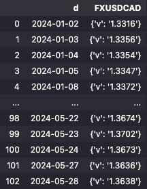
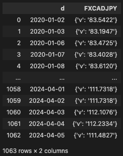
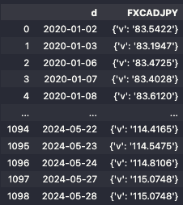

<p align="center">
  
</p>
<p align="center">
  
  
  
  
  
</p>

**AnyData** is a smart framework to interact with and fetch data from REST APIs. With **AnyData** you can define endpoint collections to reduce boilerplate code and improve code readability, while also accelerating development with [OpenAPI (Swagger) parsers](#-from-openapi-specification) and [Smart Functions](#smart-functions).

## Install

AnyData is available through PyPI. To use Smart Functions see the installation with optional dependencies at [Smart Functions](#smart-functions).

```zsh
pip install anydata
```

## DataAPI

`DataAPI` is a collection of `Endpoint`s that can be instantiated from a REST API base URL or directly from the API's [OpenAPI](https://spec.openapis.org/oas/latest.html) documentation.

### → From Base URL

```python
from anydata import DataAPI

# Instantiate a DataAPI object
valet_api = DataAPI(base_url="https://www.bankofcanada.ca/valet")

# Add endpoints
valet_api.add_endpoint("/observations/FXUSDCAD/{format}", method="GET", alias="USD_to_CAD")
valet_api.add_endpoint("/observations/FXCADUSD/{format}", method="GET", alias="CAD_to_USD")

# Set parameters to be shared across endpoints in this collection
valet_api.set_shared_params(params={"format": "json", "start_date": "2024-01-01"})
```

At this point the data can be fetched directly to a `DataFrame` object.

```python
valet_api["USD_to_CAD"].to_pandas()
```



Or retrieved in its raw format.

```python
valet_api["CAD_to_USD"].request().json()
```

```
{'terms': {'url': 'https://www.bankofcanada.ca/terms/'},
 'seriesDetail': {'FXCADUSD': {'label': 'CAD/USD',
   'description': 'Canadian dollar to US dollar daily exchange rate',
   'dimension': {'key': 'd', 'name': 'Date'}}},
 'observations': [{'d': '2024-01-02', 'FXCADUSD': {'v': '0.7510'}},
  {'d': '2024-01-03', 'FXCADUSD': {'v': '0.7487'}},
  {'d': '2024-01-04', 'FXCADUSD': {'v': '0.7488'}},
  {'d': '2024-01-05', 'FXCADUSD': {'v': '0.7492'}},
...
  {'d': '2024-05-28', 'FXCADUSD': {'v': '0.7332'}}]}
```

### → From OpenAPI Specification

A `DataAPI` collection can also be instantiated from an [OpenAPI specification](https://github.com/OAI/OpenAPI-Specification) or [Swagger Documentation](https://swagger.io/docs/specification/about/).

```python
valet_api = DataAPI.from_openapi('https://www.bankofcanada.ca/valet/static/swagger/api-en.yml')
valet_api.endpoints()
```

All available endpoints will be added as `Endpoint` objects with corresponding REST API methods and path parameters, if any.

```
[('/fx_rss', Endpoint(method="get", endpoint="/fx_rss")),
 ('/fx_rss/{seriesNames}',
  Endpoint(method="get", endpoint="/fx_rss/{seriesNames}", path_params={'seriesNames': None})),
 ('/groups/{groupName}/{format}',
  Endpoint(method="get", endpoint="/groups/{groupName}/{format}", path_params={'groupName': None, 'format': None})),
 ('/lists/{type}/{format}',
  Endpoint(method="get", endpoint="/lists/{type}/{format}", path_params={'type': None, 'format': None})),
 ('/observations/group/{groupName}/{format}',
  Endpoint(method="get", endpoint="/observations/group/{groupName}/{format}", path_params={'groupName': None, 'format': None})),
 ('/observations/{seriesNames}/{format}',
  Endpoint(method="get", endpoint="/observations/{seriesNames}/{format}", path_params={'seriesNames': None, 'format': None})),
 ('/series/{seriesName}/{format}',
  Endpoint(method="get", endpoint="/series/{seriesName}/{format}", path_params={'seriesName': None, 'format': None}))]
```

Which can then be called directly from the collection.

```python
valet_api["/observations/{seriesNames}/{format}"].to_pandas(
    params={"seriesNames": "FXUSDCAD", "format": "json"}
)
```



As a `requests.Session` subclass, `Endpoint`s can also be used as context managers.

```python
valet_api.set_shared_params(params={"format": "json"})

with valet_api["/observations/{seriesNames}/{format}"] as e:
    usd_to_cad_df = e.to_pandas(params={"seriesNames": "FXUSDCAD"})
    cad_to_usd_df = e.to_pandas(params={"seriesNames": "FXCADUSD"})
```

This will open and close a connection once to perform both API calls.

## Endpoint

An `Endpoint` can also be instantiated independently and still benefit from methods such as the `to_pandas()` parser.

```python
from anydata import Endpoint

usd_to_cad = Endpoint(
    base_url="https://www.bankofcanada.ca/valet",
    endpoint="/observations/FXUSDCAD/json",
    method="GET"
)

usd_to_cad.to_pandas()
```


## Smart Functions

**Smart Functions** leverage Large Language Models to interact with `DataAPI` objects instantiated from an OpenAPI specification, so you can spend more time with the data, and less time going through the API documentation.

To enable **Smart Functions**, you need to perform an install that brings the necessary extra dependencies:

```zsh
pip install --upgrade 'anydata[guidance]'
```

You also need to set any API Key necessary to interact with remote LLMs. The following examples assume that an OpenAI API Key is set as an environment variable, which can be easily done with a .env file and Python `dotenv`:

```python
# .env file in the project directory
OPENAI_API_KEY=sk-***********************
```

```python
from dotenv import load_dotenv

load_dotenv()
```

### Smart Add Endpoint

The `smart_add_endpoint()` method instantiates an `Endpoint` that fulfill a prompt for data in natural language.

```python
from anydata import DataAPI
from anydata.engine.models import OpenAI

# Instantiate from the Open API specification
valet_api = DataAPI.from_openapi('https://www.bankofcanada.ca/valet/static/swagger/api-en.yml')

# Load Language Model (OpenAI, Transformers, LamaCpp, Anthropic, or others...)
valet_api.set_lm(OpenAI('gpt-3.5-turbo'))

# Prompt for data from the API to instantiate an endpoint
valet_api.smart_add_endpoint(
    'Data for Canadian Dollars to Japanese Yen conversion from January 2020 onwards',
    alias='CAD_to_JPY'
)

# Fetch to pandas DataFrame
valet_api['CAD_to_JPY'].to_pandas()
```



The instantiated endpoint contains the parameters to fulfill the prompt.

```python
valet_api['CAD_to_JPY']
```

```
Endpoint(method="get", endpoint="/observations/{seriesNames}/{format}", params={'start_date': '2020-01-01'}, path_params={'seriesNames': 'FXCADJPY', 'format': 'json'})
```

This method efficiently passes the necessary information from the OpenAPI specification to the Large Language Model, hence its performance is highly dependent on the quality of the API documentation provided.

It can be used with any Chat Model supported by the [guidance](https://github.com/guidance-ai/guidance) framework.

## Contribution

**AnyData** is a project on its very early stages that is open to contributions. I will add a backlog of features that I plan to implement and the discussion sections is wide open to any suggestion - including reinterpretations of existing functionalities. A dedicated contributions documentation should also be coming up soon.

If you want to be an early contributor, feel free to fork the repository and open a PR.
