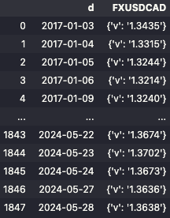

# AnyData

Smart framework to interact with and fetch data from REST APIs.

## Installation

```zsh
pip install anydata
```

## DataAPI

Speed-up your interaction with public datasets available at REST APIs endpoints with a `DataAPI` object.

```python
from anydata import DataAPI
from anydata.engine.models import OpenAI

# Instantiate from the Open API specification
valet_api = DataAPI.from_openapi('https://www.bankofcanada.ca/valet/static/swagger/api-en.yml')

# Load Language Model (OpenAI, Transformers, LamaCpp, Anthropic, or others...)
valet_api.set_lm(OpenAI('gpt-3.5-turbo'))

# Prompt for data from the API to instantiate an endpoint
valet_api.smart_add_endpoint(
    'Data for Canadian Dollars to Japanese Yen conversion from January 2020 onwards',
    alias='CAD_to_JPY'
)

# Fetch to pandas DataFrame
valet_api['CAD_to_JPY'].to_pandas()
```



The `.smart_add_endpoint()` method instantiates an endpoint at the DataAPI collection to fulfill the prompt:

```python
valet_api['CAD_to_JPY']
```

```
Endpoint(method="get", endpoint="/observations/{seriesNames}/{format}", params={'start_date': '2020-01-01'}, path_params={'seriesNames': 'FXCADJPY', 'format': 'json'})
```

---

### A simple and elegant way to interact with REST APIs

A `DataAPI` object is a collection of `Endpoint` sessions.

1. You can instantiate a collection from a base URL and manage endpoints individually.

```python
from anydata import DataAPI

valet_api = DataAPI(base_url="https://www.bankofcanada.ca/valet")

# Add endpoint
valet_api.add_endpoint(
    "/observations/{seriesNames}/{format}",
    method="GET",
    params={"format": "json", "seriesNames": "FXUSDCAD"},
    alias="USD_to_CAD"
)

# Fetch to pandas DataFrame
valet_api["USD_to_CAD"].to_pandas()
```


2. Or populate it with all available endpoints by parsing an Open API specification with the `.from_openapi()` method.

```python
valet_api = DataAPI.from_openapi('https://www.bankofcanada.ca/valet/static/swagger/api-en.yml')
valed_api.endpoints()
```

```
[('/fx_rss', Endpoint(method="get", endpoint="/fx_rss")),
 ('/fx_rss/{seriesNames}',
  Endpoint(method="get", endpoint="/fx_rss/{seriesNames}", path_params={'seriesNames': None})),
 ('/groups/{groupName}/{format}',
  Endpoint(method="get", endpoint="/groups/{groupName}/{format}", path_params={'groupName': None, 'format': None})),
 ('/lists/{type}/{format}',
  Endpoint(method="get", endpoint="/lists/{type}/{format}", path_params={'type': None, 'format': None})),
 ('/observations/group/{groupName}/{format}',
  Endpoint(method="get", endpoint="/observations/group/{groupName}/{format}", path_params={'groupName': None, 'format': None})),
 ('/observations/{seriesNames}/{format}',
  Endpoint(method="get", endpoint="/observations/{seriesNames}/{format}", path_params={'seriesNames': None, 'format': None})),
 ('/series/{seriesName}/{format}',
  Endpoint(method="get", endpoint="/series/{seriesName}/{format}", path_params={'seriesName': None, 'format': None}))]
```

```python
# Fetch to pandas DataFrame
valet_api["/observations/{seriesNames}/{format}"].to_pandas(
    params={"seriesNames": "FXUSDCAD", "format": "json"}
)
```


